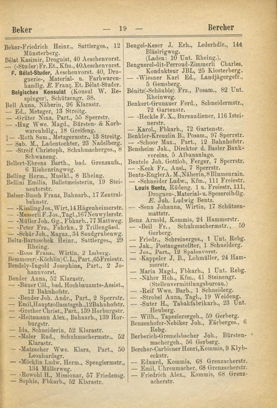
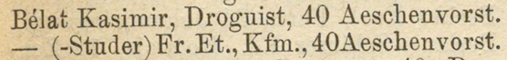
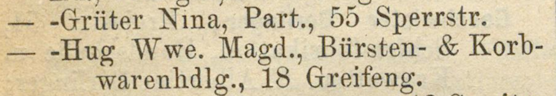
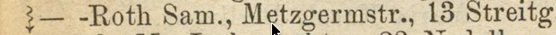

# Information about the address books
Here we provide a quick reference guide about how the original sources are structured.

This is an example, of how an address book page looks like in the original source:

One challenge for the OCR text extraction is the segmentation of the page into different columns.  
As of right now, we preprocess these pages and cut them into their different columns to avoid transcription issues.

Another key challenge is the transcription of the longer "—" vs the shorter "-":  

- The long dash means "insert previous last name here"; in the above screenshot the person bellow 'Bèlat Kasimir' would be 'Bèlat (-Studer) Fr.Et.'
- The short dash connects the person's own lastname to the partner's last name

In the address books the "lighting" signs symbolize that that person has a telephone, which is also challenging to transcribe consistently:  

