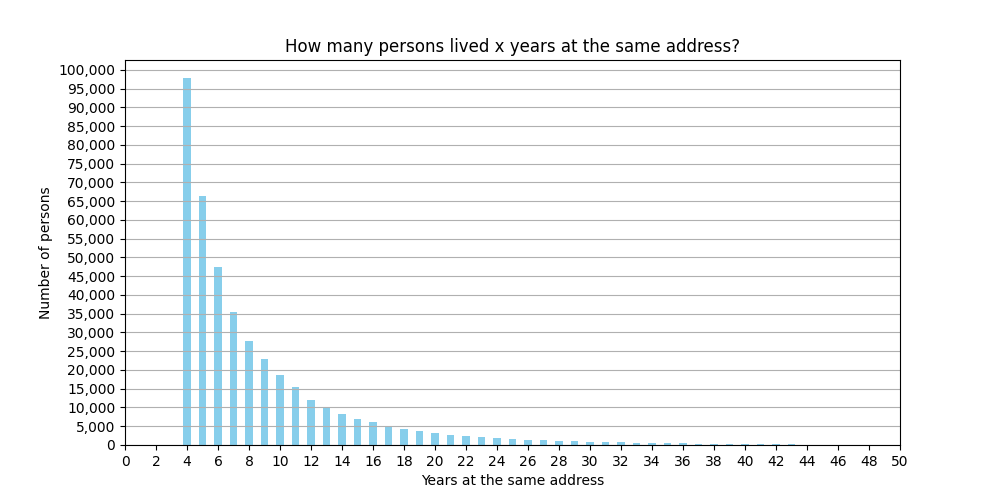

# Module Description
Run the scripts in this module in order to gain metric insights about the panel dataset.

## Analysis results
**Distribution of persons that lived x years at the same address:**  
1 year: 999'883 persons  
2 years: 285'864 persons  
3 years: 153'655 persons  
