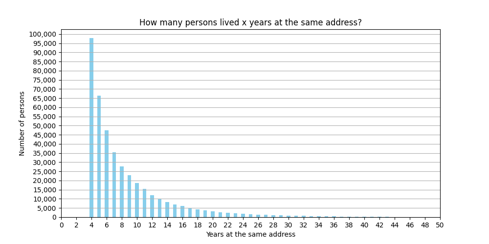

# Dataset analysis
Her you can find information about different metrics concerning the created dataset.

## Analysis results
**Distribution of persons that lived x years at the same address:**  
1 year: 999'883 persons  
2 years: 285'864 persons  
3 years: 153'655 persons  

## Houshold 
### Household size
### Etagenangaben
TODO: is it possible to find information about the floor number where the person lived?

## Wives
How many wives and husbands are found in the dataset?

